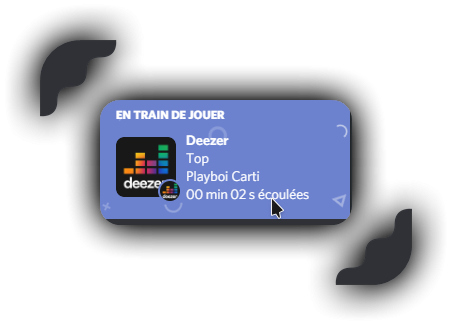

# What is deezerRPC ?

DeezerRPC is a small application that let you display your current deezer music on discord

 spotify version

 deezerRPC version

# Installation

Install [chromedriver](https://chromedriver.chromium.org/downloads) that correspond with your chrome version
.And run setup.bat.
After this you can launch the deezerRPC.jar file you've downloaded in the release tab
Make sure to have java install on your pc
# Usage

Just click on the login button & login to your deezer account, and you're good to go

### Support

If you need help you can contact me on discord (TAKEFY#9831) or make a GitHub issue
